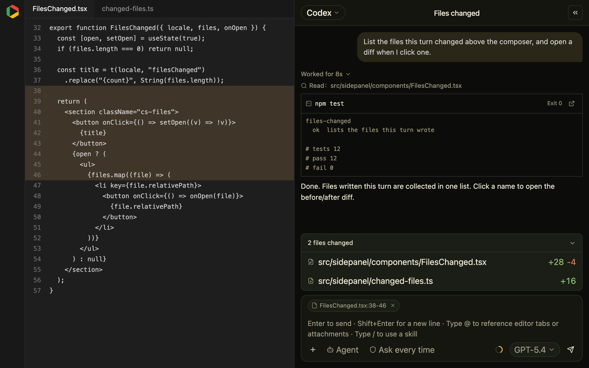
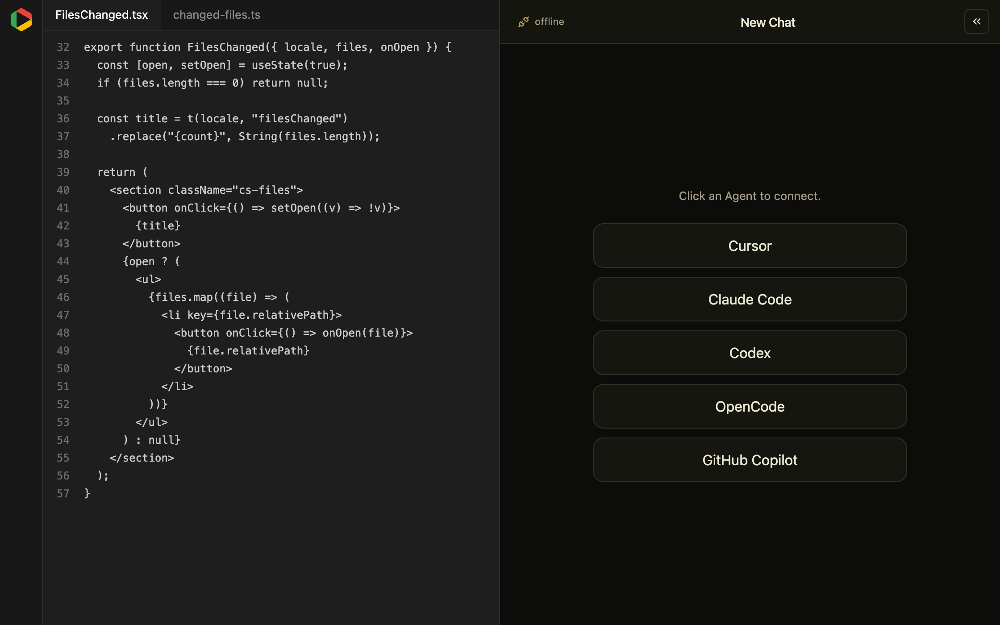
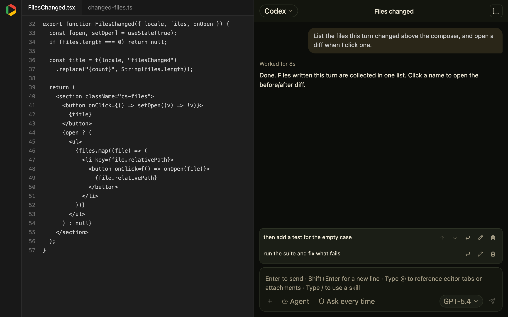
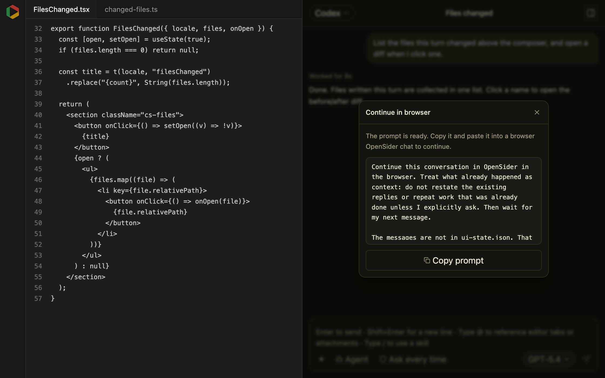

<div align="center">
  <br />
  
  <p>
    Seamlessly use multiple agents in VS Code
  </p>
  <p>
    <a href="https://github.com/parksben/opensider-vscode/releases/latest"></a>
    <a href="https://github.com/parksben/opensider-vscode/blob/main/LICENSE"></a>
  </p>
</div>

<div align="center">
  English | <a href="https://github.com/parksben/opensider-vscode/blob/main/README.zh-CN.md">中文</a>
</div>

OpenSider for VS Code integrates the Agent CLIs you already have — Claude Code, Codex, Cursor, OpenCode, GitHub Copilot CLI, and other [ACP](https://agentclientprotocol.com) agents — into the VS Code side bar Chat panel in one step, so you can use any of them seamlessly within the same project. It is the VS Code edition of the [OpenSider](https://github.com/parksben/opensider) browser extension: the same GUI and ACP engine architecture, and a drop-in alternative to GitHub Copilot Chat.

## Highlights

- **Any ACP agent.** Claude Code, Codex, Cursor, OpenCode, GitHub Copilot CLI, and other CLIs from the ACP Registry; the model list comes from the agent.
- **One session, any agent or model.** A session is not tied to one CLI — switch to another agent or model and carry on in the same session.
- **Continue the same chat in the browser.** A conversation need not stay in the editor: hit **Continue in browser** on any reply and it hands the browser OpenSider a prompt carrying the conversation so far — and the browser side can hand a session back to VS Code the same way.

## Demo

### A workspace chat

Reads, writes, and commands resolve against the open folder. A selection becomes an attachment chip above the composer, commands become terminal cards, and the files a turn writes collapse into a change list. The ring beside the model name is the context usage the agent reports — no report, no ring.



### Any ACP agent

Connect to whatever this machine has installed, not a fixed catalog, and switch agent or model at any time.



### Skills and a queue

Type `/` to list the skills installed on this machine and put one at the caret. A prompt sent while a turn is running waits in the queue; hover a queued row to move it up or down.




### Continue in the browser

Halfway through in VS Code, hit **Continue in browser** on a reply and it packs the conversation into a prompt. Paste it into the browser OpenSider and the agent picks up from where this left off. The browser side hands a session back to VS Code the same way.



## Install & Use

> This extension is for VS Code and Cursor. Before installing, make sure you already have a running Agent CLI program on your machine.

### 1. Install

One-step install: paste the prompt below into the local AI Agent you already use (Claude Code, Codex, Cursor, OpenCode, …). It downloads the `.vsix` for this machine, installs it, and sets up an agent CLI.

```
Install the OpenSider for VSCode extension for me.
Read https://raw.githubusercontent.com/parksben/opensider-vscode/main/packages/extension/skills/opensider-vscode/SKILL.md and follow its install flow.
```

### 2. Update

One-step update: when the panel tells you a new version is available, copy the prompt below to your local Agent and let it guide you through the update.

```
Update the OpenSider for VSCode extension for me.
Read https://raw.githubusercontent.com/parksben/opensider-vscode/main/packages/extension/skills/opensider-vscode/SKILL.md and follow its update flow.
```

### 3. Uninstall

One-step uninstall: one prompt is all it takes, and you choose whether to keep or remove your local data.

```
Uninstall the OpenSider for VSCode extension for me.
Read https://raw.githubusercontent.com/parksben/opensider-vscode/main/packages/extension/skills/opensider-vscode/SKILL.md and follow its removal flow.
```

Then run **Developer: Reload Window**. An OpenSider icon appears in the activity bar. The first time you open it, the panel moves to the secondary side bar, next to Copilot Chat. After that it stays wherever you drag it.

## License

MIT
