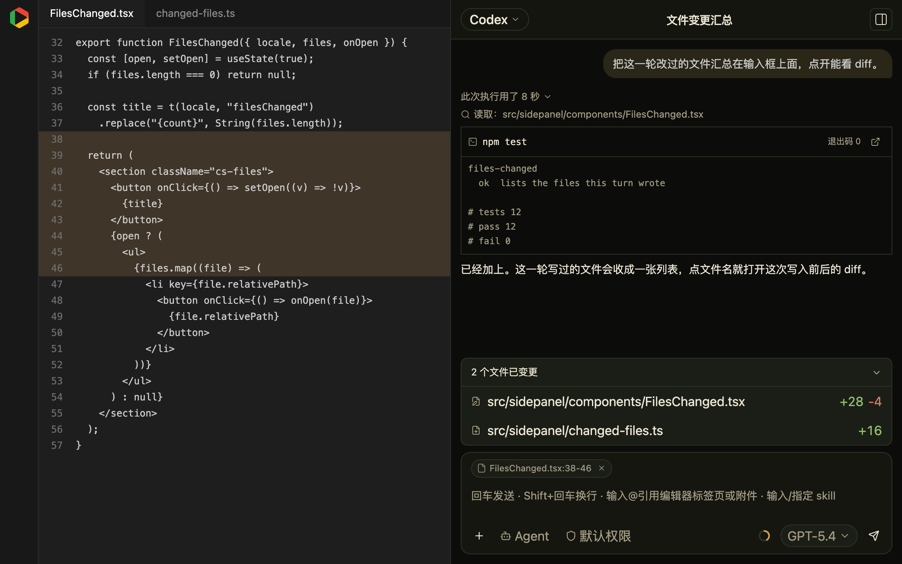
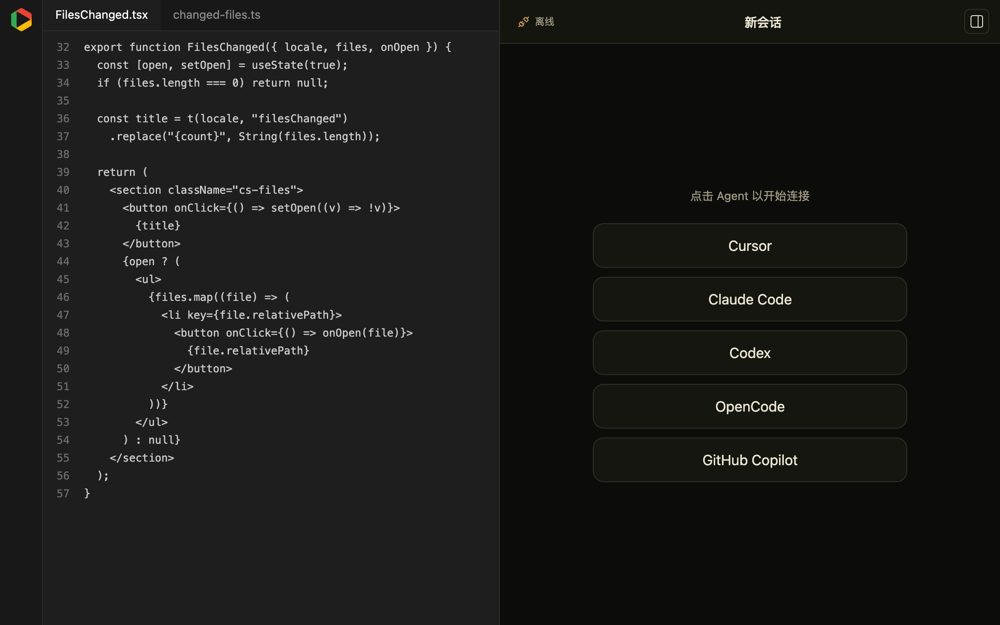
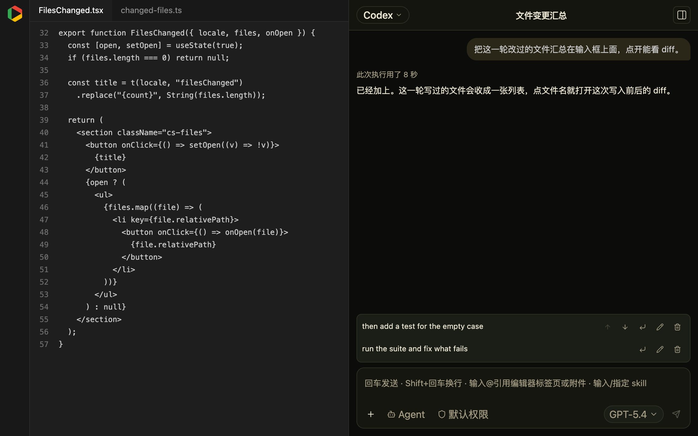
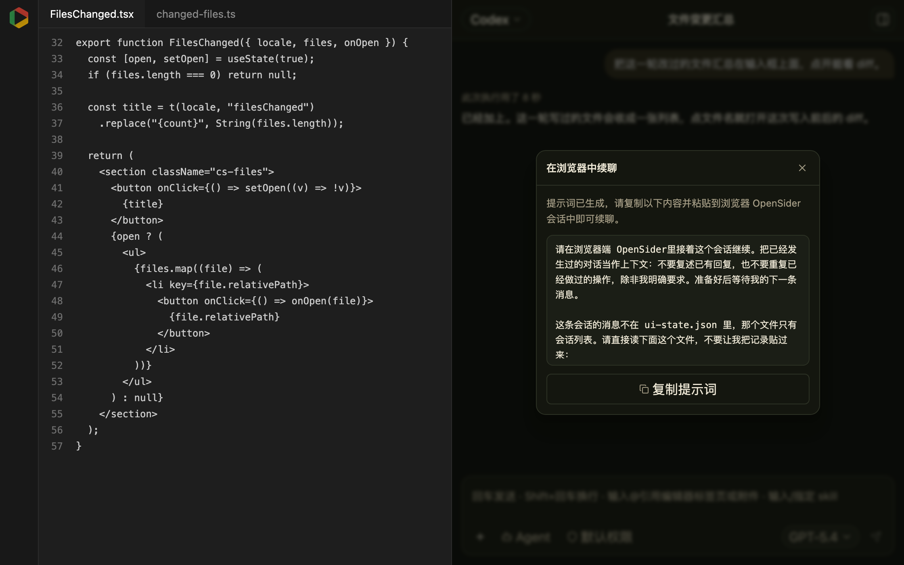
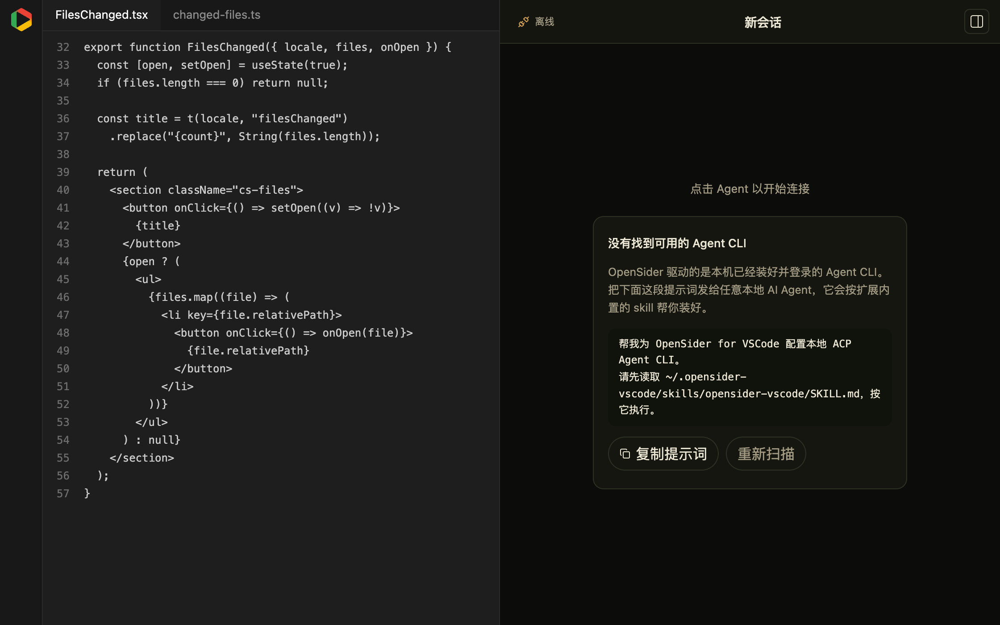

<div align="center">
  <br />
  
  <p>
    在 VS Code 中无缝使用多类 Agent
  </p>
  <p>
    <a href="https://github.com/parksben/opensider-vscode/releases/latest"></a>
    <a href="https://github.com/parksben/opensider-vscode/blob/main/LICENSE"></a>
  </p>
</div>

<div align="center">
  <a href="https://github.com/parksben/opensider-vscode/blob/main/README.md">English</a> | 中文
</div>

OpenSider for VS Code：把本机已有的 Agent CLI —— Claude Code、Codex、Cursor、OpenCode、GitHub Copilot CLI，以及其它 [ACP](https://agentclientprotocol.com) Agent —— 一键集成进 VS Code 侧边栏 Chat 面板，可以在同一个项目中无缝使用各类 Agent 终端。它是 [OpenSider](https://github.com/parksben/opensider) 浏览器扩展的 VS Code 版：相同的 GUI 设计和 ACP 引擎架构，可当作 GitHub Copilot Chat 的平替。

面板语言跟随 VS Code 的显示语言；下面是中文界面。

## 功能亮点

- **接入任意 ACP Agent。** Claude Code、Codex、Cursor、OpenCode、GitHub Copilot CLI，以及 ACP Registry 里的其它 CLI；模型列表由 Agent 自己上报。
- **同一会话里换 Agent 和模型。** 会话不绑死在某一家 CLI 上：随时切换到另一个 Agent 或模型，在同一个会话里继续。
- **与浏览器 OpenSider 插件无缝续聊。** 会话不必锁在编辑器里：点任意回复上的「在浏览器中续聊」，就会带着这段对话生成一条提示词，粘进浏览器版 OpenSider 即可接着往下做；反过来，浏览器那边也能把会话交回 VS Code。

## 演示

### 工作区对话

读取、修改和命令都作用于当前打开的文件夹。划选一段代码就变成输入框上方的附件芯片，命令变成终端卡片，这一轮写入的文件收成变更列表。模型名旁边的环是 Agent 上报的上下文用量 —— 不上报就不显示。



### 接入任意 ACP Agent

连接的是本机实际装了什么，而不是写死的目录；随时可以换 Agent 或模型。



### Skill 与队列

输入 `/` 会列出本机已装的 skill，并把它插到光标处。回复还在跑时发送的提示会先排队；悬浮某一行可以上移或下移。




### 与浏览器 OpenSider 续聊

在 VS Code 里聊到一半，点回复上的「在浏览器中续聊」，它会把这段对话打包成一条提示词。复制到浏览器版 OpenSider，Agent 就从这里的状态接着做；浏览器那边同样能把会话交回 VS Code。



## 安装使用

> 本扩展用于 VS Code 与 Cursor。安装前请确保本机已有正在运行的 Agent CLI 程序。

### 1. 安装

一键安装：把下面这段提示词复制给你正在使用的本地 AI Agent（Claude Code、Codex、Cursor、OpenCode 等），它会下载和本机匹配的 `.vsix`、安装插件，并配好一个 Agent CLI。

```
帮我安装 OpenSider for VSCode。
请先读取 https://raw.githubusercontent.com/parksben/opensider-vscode/main/packages/extension/skills/opensider-vscode/SKILL.md，按其安装流程执行。
```

### 2. 更新

一键更新：当侧栏提示有新版本时，可复制以下提示词给你的本地 Agent，在其引导下完成更新。

```
帮我更新 OpenSider for VSCode。
请先读取 https://raw.githubusercontent.com/parksben/opensider-vscode/main/packages/extension/skills/opensider-vscode/SKILL.md，按其更新流程执行。
```

### 3. 卸载

一键卸载：同样只需一段提示词，卸载时可选择保留或移除本地已有数据。

```
帮我卸载 OpenSider for VSCode。
请先读取 https://raw.githubusercontent.com/parksben/opensider-vscode/main/packages/extension/skills/opensider-vscode/SKILL.md，按其卸载流程执行。
```

装完执行一次 **Developer: Reload Window**。活动栏会出现 OpenSider 图标。首次打开时面板会移到右侧辅助栏，和 Copilot Chat 并列；之后你把它拖到哪里，它就留在哪里。

插件不含模型，驱动的是本机的 ACP Agent CLI。找不到任何 Agent 时，侧栏会给出同样形式的卡片提示词；安装后的 skill 在 `~/.opensider-vscode/skills/opensider-vscode/SKILL.md`。



## 本地数据

| 路径 | 内容 |
|---|---|
| `~/.opensider-vscode/workspaces/<bucket>/ui-state.json` | 会话列表和工作区偏好 |
| `~/.opensider-vscode/workspaces/<bucket>/sessions/<id>.json` | 该会话的消息 |
| `~/.opensider-vscode/global-state.json` | 所有窗口共用的偏好 |
| `~/.opensider-vscode/runtime/` | Claude Code / Codex 的 ACP 适配器 |
| `~/.opensider-vscode/skills/` | 无 Agent 时用于引导配置的 skill |
| `~/.opensider-vscode/uploads/` | 拖入或粘贴的附件副本 |
| `~/.opensider-vscode/host.log` | 宿主日志，排查问题先看它 |

和浏览器版的 `~/.opensider` 完全分开，两边互不影响，可以同时装。

## 已知边界

不同 Agent 对 ACP 的支持程度不同，有些能力只在部分 Agent 上出现：

| 能力 | 支持的 Agent |
|---|---|
| VS Code 终端执行 | Codex、GitHub Copilot CLI |
| 上下文用量环 | Codex、GitHub Copilot CLI |
| 会话模式（plan / build…） | 各家自行广告，Cursor、Claude Code 等有 |

Claude Code 和 Cursor Agent 自己跑命令、也不上报用量，此时命令卡片退回读取工具调用的输出，用量环不显示。这是协议层面的差异，不是缺陷。

## License

MIT
