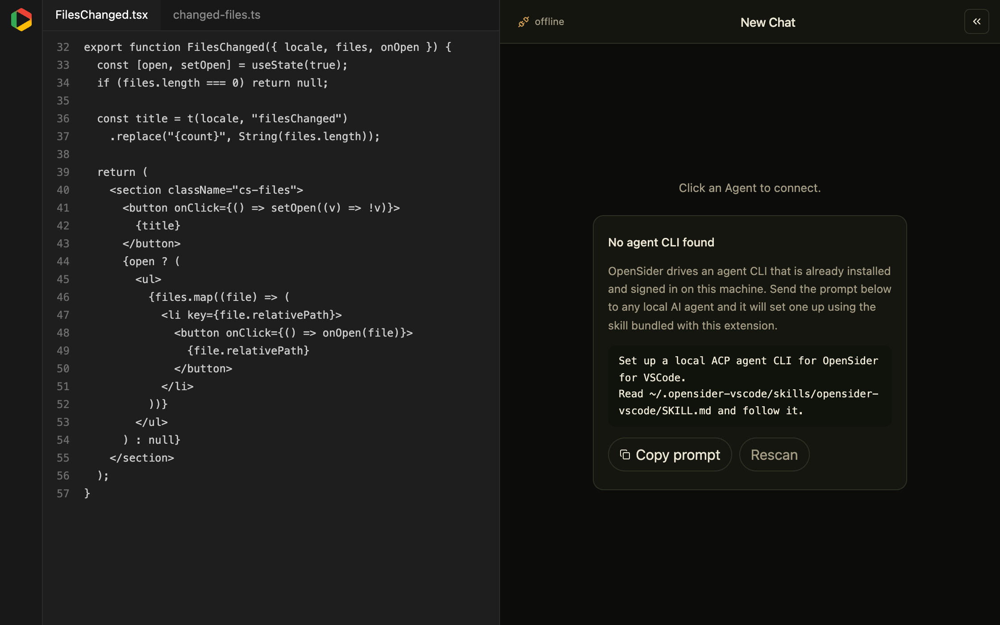

# OpenSider for VSCode

English | [中文](https://github.com/parksben/opensider-vscode/blob/main/README.zh-CN.md)

OpenSider runs the Agent CLI you already have — Claude Code, Codex, Cursor, OpenCode, GitHub Copilot CLI, and other [ACP](https://agentclientprotocol.com) agents — inside the VS Code side bar. There is no bundled model and no account of ours: it drives the CLI you installed and signed in to, in the workspace you have open. State stays on this machine under `~/.opensider-vscode`.

It is the VS Code counterpart of the [OpenSider](https://github.com/parksben/opensider) browser extension: the same panel and the same ACP engine, scoped to your workspace. Use it in place of GitHub Copilot Chat, with the model and account coming from your own CLI.

The panel follows VS Code's display language; the screenshots below are the English UI.

## Highlights

- **Runs in your workspace.** The agent's reads, edits, and shell commands resolve against the open folder — no scratch directory, no re-upload.
- **Any ACP agent.** Claude Code, Codex, Cursor, OpenCode, GitHub Copilot CLI, and other CLIs from the ACP Registry. Switch agent or model mid-session; the model list comes from the agent.
- **Editor context.** Select code and it becomes an attachment with its file and line range; pin more selections from the editor's right-click menu with **Add Selection to OpenSider**.
- **Reviewable and local.** Shell commands surface as terminal cards backed by a real VS Code terminal, every file a turn writes opens as a before/after diff, `/` inserts a skill and queued prompts reorder — and sessions, preferences and the agent runtime stay under `~/.opensider-vscode`.

## Demo

### Runs in your workspace

Reads, writes, and commands resolve against the open folder. A selection becomes an attachment chip above the composer, commands become terminal cards, and the files a turn writes collapse into a change list. The ring beside the model name is the context usage the agent reports — no report, no ring.


### Any ACP agent

Connect to whatever this machine has installed, not a fixed catalog, and switch agent or model at any time.


### Skills and a queue

Type `/` to list the skills installed on this machine and put one at the caret. A prompt sent while a turn is running waits in the queue; hover a queued row to move it up or down.


## Install & Use

> This extension is for VS Code and Cursor. Before installing, make sure you already have a running Agent CLI program on your machine.

### 1. Install

One-step install: paste the prompt below into the local AI Agent you already use (Claude Code, Codex, Cursor, OpenCode, …). It downloads the `.vsix` for this machine, installs it, and sets up an agent CLI.

```
Install the OpenSider for VSCode extension for me.
Read https://raw.githubusercontent.com/parksben/opensider-vscode/main/packages/extension/skills/opensider-vscode/SKILL.md and follow its install flow.
```

### 2. Update

One-step update: when the panel tells you a new version is available, copy the prompt below to your local Agent and let it guide you through the update.

```
Update the OpenSider for VSCode extension for me.
Read https://raw.githubusercontent.com/parksben/opensider-vscode/main/packages/extension/skills/opensider-vscode/SKILL.md and follow its update flow.
```

### 3. Uninstall

One-step uninstall: one prompt is all it takes, and you choose whether to keep or remove your local data.

```
Uninstall the OpenSider for VSCode extension for me.
Read https://raw.githubusercontent.com/parksben/opensider-vscode/main/packages/extension/skills/opensider-vscode/SKILL.md and follow its removal flow.
```

Then run **Developer: Reload Window**. An OpenSider icon appears in the activity bar. The first time you open it, the panel moves to the secondary side bar, next to Copilot Chat. After that it stays wherever you drag it.

The extension includes no model: it drives an ACP Agent CLI on this machine. When none is found, the panel shows a card with the same kind of prompt, and the skill it points at lives at `~/.opensider-vscode/skills/opensider-vscode/SKILL.md`.



## Local data

| Path | Contents |
|---|---|
| `~/.opensider-vscode/workspaces/<bucket>/ui-state.json` | Session list and workspace preferences |
| `~/.opensider-vscode/workspaces/<bucket>/sessions/<id>.json` | That session's messages |
| `~/.opensider-vscode/global-state.json` | Preferences shared by every window |
| `~/.opensider-vscode/runtime/` | ACP adapters for Claude Code and Codex |
| `~/.opensider-vscode/skills/` | The skill used when no agent is installed yet |
| `~/.opensider-vscode/uploads/` | Copies of dropped or pasted attachments |
| `~/.opensider-vscode/host.log` | Host log. Start here when something fails |

This tree is separate from the browser extension's `~/.opensider`. The two can be installed together.

## Known limits

Agents implement ACP to different degrees, so some capabilities only appear for some of them:

| Capability | Agents |
|---|---|
| Run in a VS Code terminal | Codex, GitHub Copilot CLI |
| Context-usage ring | Codex, GitHub Copilot CLI |
| Session modes (plan / build / …) | Whatever the agent advertises. Cursor and Claude Code do |

Claude Code and Cursor Agent run commands themselves and do not report usage. Their command card falls back to the tool-call output, and the usage ring stays hidden. That is a protocol difference, not a bug in this extension.

## License

MIT
