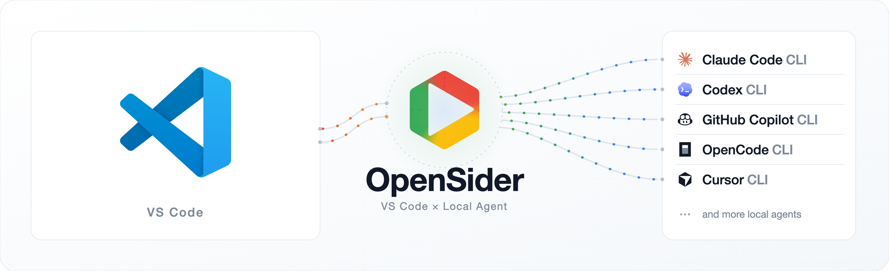

<div align="center">
  <br />
  
  <p>
    Use multiple agent CLIs in VS Code
  </p>
  <p>
    <a href="https://github.com/parksben/opensider-vscode/releases/latest"></a>
    <a href="https://github.com/parksben/opensider-vscode/blob/main/LICENSE"></a>
  </p>
</div>

<div align="center">
  English | <a href="https://github.com/parksben/opensider-vscode/blob/main/README.zh-CN.md">中文</a>
</div>

**OpenSider for VS Code** brings the agent CLIs you already have (Claude Code, Codex, Cursor, OpenCode, GitHub Copilot CLI, and other [ACP](https://agentclientprotocol.com) agents) into the VS Code side bar Chat panel, so you can use any of them in the same project. It is the VS Code edition of the [OpenSider](https://github.com/parksben/opensider) browser extension, with the same GUI and the same ACP engine, and works as an alternative to GitHub Copilot Chat.

## Highlights

- **Any ACP agent.** Claude Code, Codex, Cursor, OpenCode, GitHub Copilot CLI, and other CLIs from the ACP Registry. The model list comes from the agent.
- **One session, any agent or model.** Start with one agent, switch to another mid-session, and keep the same conversation.
- **Continue the same chat in the browser.** Hit **Continue in browser** on any reply and OpenSider turns the conversation into a prompt for the browser extension. A session can come back from the browser to VS Code the same way.

## Demo

### A workspace chat

Reads, edits and shell commands run against the folder you have open. A selection becomes an attachment chip above the composer, a command becomes a terminal card, and the files a turn writes collect into a change list. A ring next to the model name shows the context the agent reports.


### Any ACP agent

Connect to whatever this machine has installed. You can switch agent or model at any time.


### Skills and a queue

Type `/` to list the skills installed on this machine and put one at the caret. A prompt sent while a turn is running waits in the queue; hover a queued row to move it up or down.


### Continue in the browser

Halfway through a task in VS Code, hit **Continue in browser** on a reply. OpenSider turns the conversation into a prompt; paste it into the browser extension and the agent continues from there. A session can go back to VS Code the same way.


## Install & Use

> This extension is for VS Code. Before installing, make sure you have an agent CLI set up on this machine.

### 1. Install

Paste the prompt below into the local agent you already use. It downloads the `.vsix` for this machine, installs it, and sets up an agent CLI.

```
Install the OpenSider for VSCode extension for me.
Read https://raw.githubusercontent.com/parksben/opensider-vscode/main/packages/extension/skills/opensider-vscode/SKILL.md and follow its install flow.
```

### 2. Update

When the panel reports a new version, copy the prompt below to your local agent and it will guide the update.

```
Update the OpenSider for VSCode extension for me.
Read https://raw.githubusercontent.com/parksben/opensider-vscode/main/packages/extension/skills/opensider-vscode/SKILL.md and follow its update flow.
```

### 3. Uninstall

Copy the prompt below to your local agent. You choose whether to keep or delete your local data.

```
Uninstall the OpenSider for VSCode extension for me.
Read https://raw.githubusercontent.com/parksben/opensider-vscode/main/packages/extension/skills/opensider-vscode/SKILL.md and follow its removal flow.
```

Then run **Developer: Reload Window**. An OpenSider icon appears in the activity bar. The first time you open it, the panel moves to the secondary side bar, next to Copilot Chat. After that it stays wherever you drag it.

## License

MIT
